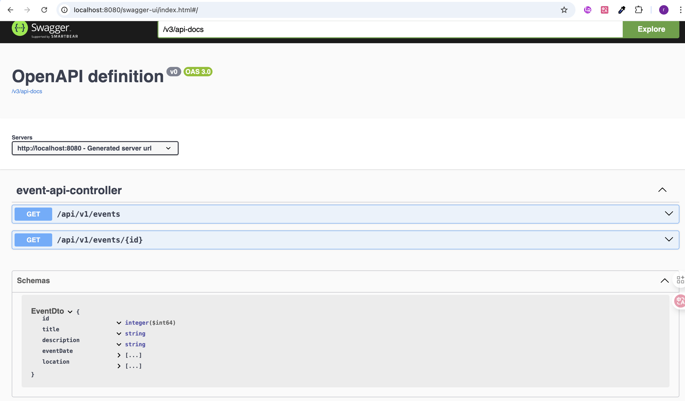
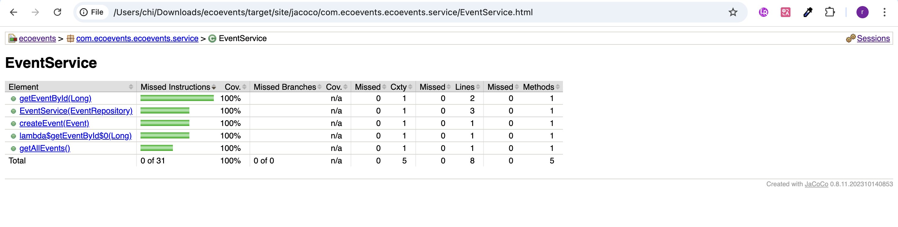

# EcoEvents – Full-Stack Volunteer & Event Management Platform

EcoEvents is a full-stack web application that helps small environmental charities publish events and manage volunteer sign-ups without needing a dedicated tech team.

**Project Goal:** Demonstrate practical application of Spring Boot, REST APIs, JPA/Hibernate, and test-driven development principles.

## Screenshots

### API Documentation (Swagger UI)


### Test Coverage Report



## Features

- Event Showcase: Dynamic display of upcoming events fetched from MySQL database
- Volunteer Registration: Secure form submission with server-side validation
- Data Persistence: Fully normalized MySQL schema (Events, Volunteers, Registrations)
- Responsive UI: Clean, card-based interface with Thymeleaf templating
- API Documentation: Interactive Swagger UI for testing endpoints

---

## Tech Stack

**Backend**
- Java 17
- Spring Boot 3.5.7
- Spring Data JPA
- Hibernate ORM

**Frontend**
- Thymeleaf template engine
- HTML5 & CSS3

**Database**
- MySQL 8.0
- 3 normalized tables (Events, Volunteers, Registrations)

**Testing**
- JUnit 5
- Mockito
- JaCoCo coverage reporting


## REST API Documentation

The application provides a RESTful API documented via SpringDoc OpenAPI (Swagger UI).

**Access:** http://localhost:8080/swagger-ui.html

### Endpoints

**Events**
- GET `/api/events` - Retrieve all events
- GET `/api/events/{id}` - Get event by ID
- POST `/api/events` - Create new event

**Volunteers**
- GET `/api/volunteers` - Retrieve all volunteers
- POST `/api/volunteers` - Register new volunteer

### Example Response

```json
[
  {
    "id": 1,
    "title": "Spring Park Clean-Up",
    "description": "Join us to clean up East London Waterworks Park!",
    "eventDate": "2026-03-15",
    "location": "East London Waterworks Park",
    "maxVolunteers": 50
  }
]
```

---

## Testing

Implemented unit tests for service layer using JUnit 5 and Mockito.

**Coverage:** 5 unit tests covering business logic
**Framework:** JUnit 5 + Mockito for mocking dependencies

Run tests:
```bash
./mvnw test
```

Generate coverage report:
```bash
./mvnw test jacoco:report
open target/site/jacoco/index.html
```

---

## How to Run

**Prerequisites:** Java 17, Maven 3.6+, MySQL 8.0+

1. Clone the repository
```bash
git clone https://github.com/2304685665-sketch/EcoEvents-FullStack.git
cd EcoEvents-FullStack
```

2. Create MySQL database
```sql
CREATE DATABASE ecoevents;
```

3. Configure database in `application.properties`
```properties
spring.datasource.url=jdbc:mysql://localhost:3306/ecoevents
spring.datasource.username=YOUR_USERNAME
spring.datasource.password=YOUR_PASSWORD
```

4. Run the application
```bash
./mvnw spring-boot:run
```

5. Access the application
- Web UI: http://localhost:8080
- API Docs: http://localhost:8080/swagger-ui.html

---

## Project Structure

```
EcoEvents-FullStack/
├── src/main/java/com/ecoevents/ecoevents/
│   ├── controller/         # REST Controllers
│   ├── service/            # Business Logic
│   ├── repository/         # Data Access (JPA)
│   ├── model/              # Entity Classes
│   └── EcoeventsApplication.java
├── src/main/resources/
│   ├── application.properties
│   ├── templates/          # Thymeleaf HTML
│   └── static/             # CSS, JS
├── src/test/java/
│   └── service/            # Unit Tests
└── pom.xml
```

---

## Key Learning Outcomes

- Spring Boot MVC architecture (Controller → Service → Repository)
- RESTful API design with proper HTTP methods and status codes
- JPA/Hibernate ORM for database operations
- Database normalization (3NF) with foreign key relationships
- Unit testing with JUnit and Mockito
- API documentation with SpringDoc OpenAPI
- Git version control with structured commits


## Author

Rui Chen
- GitHub: [@2304685665-sketch](https://github.com/2304685665-sketch)
- Email: c3064533@newcastle.ac.uk